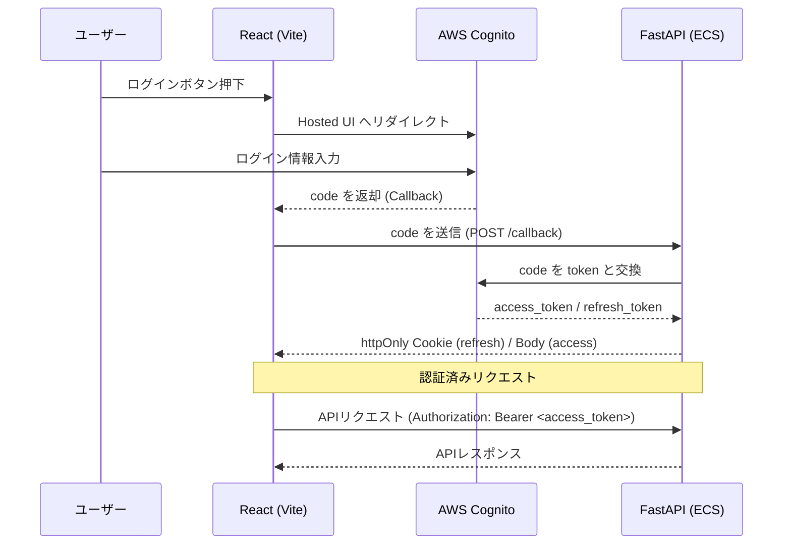
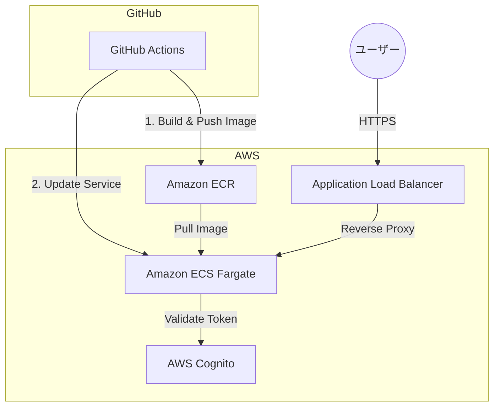

# FastAPI + React + AWS Cognito + ECS + GitHub Actions

## 概要

FastAPI をバックエンド、React（Vite + TypeScript）をフロントエンドとした  
**JWT 認証付き SPA Web アプリ**です。

認証基盤として **AWS Cognito（Authorization Code Flow + PKCE）** を利用し、  
バックエンドは **Amazon ECS (Fargate)** にデプロイ、  
**GitHub Actions による CI/CD** を構築しています。

---

## 開発背景

セキュアな認証基盤（OAuth 2.0/PKCE）をモダンなクラウド環境でフルスタックに構築の学習
実務に近いCI/CD環境を個人開発での際限

## 主な機能

- AWS Cognito を利用したユーザー認証
- Authorization Code Flow + PKCE
- JWT（access_token / id_token / refresh_token）による認証
- refresh_token は httpOnly Cookie に保存
- CSRF 対策を考慮した設計
- 認証済みユーザーのみアクセス可能な API
- GitHub Actions による ECS 自動デプロイ

---

## 技術スタック

### フロントエンド

- React
- TypeScript
- Vite
- React Router
- Fetch API

### バックエンド

- FastAPI
- Python 3.11
- python-jose（JWT 検証）
- requests

### 認証・セキュリティ

- AWS Cognito
- OAuth 2.0 Authorization Code Flow + PKCE
- JWT（RS256）
- httpOnly Cookie
- CSRF 対策（SameSite / Cookie 利用）

### インフラ・CI/CD

- Docker
- Amazon ECR
- Amazon ECS (Fargate)
- GitHub Actions
- AWS IAM

---

## 認証フロー

1. フロントエンドから Cognito Hosted UI にリダイレクト
2. Cognito でログイン
3. `/callback` に authorization_code が返却
4. FastAPI が Cognito `/oauth2/token` にコードを送信
5. access_token / id_token / refresh_token を取得
6. refresh_token は httpOnly Cookie に保存
7. access_token を使って API を呼び出し

---

## セキュリティ設計

- refresh_token は **httpOnly Cookie**
- JavaScript から直接取得不可（XSS 対策）
- CSRF を考慮した Cookie 設定
- JWT は Cognito の JWKS で署名検証
- token_use が access のみを許可

---

## CI/CD

- GitHub Actions を利用
- main ブランチ push で自動実行
- Docker イメージを ECR に push
- ECS サービスを自動更新

---

## システム構成図

### 1. 認証・リクエストフロー

ユーザーがログインしてからAPIを呼び出すまでの流れを可視化したシーケンス図



### 2. インフラ・CI/CD構成

GitHub ActionsからAWSへのデプロイと、実行環境の繋がりを示した構成図



---

## ローカル起動

```bash
docker-compose up --build
```

Frontend: http://localhost:5173

Backend: http://localhost:8000


---

## AWS デプロイ

ECR に Docker イメージを push

ECS (Fargate) で起動

GitHub Actions により自動化


